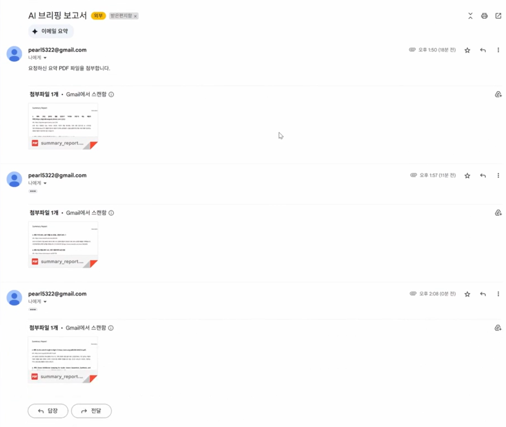

# DABS (Daily AI Briefing Service)

# 1. 프로젝트 개요

**DABS (Daily AI Briefing Service)** 는 사용자의 자연어 프롬프트를 기반으로,
뉴스·블로그·논문 등 다양한 형태의 콘텐츠를 자동 수집, 요약, 정리하여 PDF 리포트로 제공하고,
RAG 기반 챗봇을 통해 질의응답까지 지원하는 **AI 리서치 자동화 서비스**입니다.

본 서비스는 단일 키워드 입력만으로 다음과 같은 일련의 리서치 과정을 자동화합니다:

- 키워드 의미 확장 (LLM 기반 동의어 생성)
- 관련 콘텐츠 수집 (뉴스 API, 블로그 크롤러, 논문 API 등)
- AI 요약 (KoBART, BART, Sentence-BERT 등 활용)
- 유사도 필터링 기반 품질 관리
- 리포트 자동 생성 (PDF)
- 챗봇을 통한 질의응답 (LangChain + FAISS 기반 RAG)

**방대한 정보**를 다뤄야 하는 **콘텐츠 기획자, 마케터, 전략 담당자**들이
**신속**하고 **정확**하게 **핵심 자료**를 파악할 수 있도록 설계되었습니다.


# 2. 팀 소개

| Web / SW | AI / Data | SW / Data |
|:--------:|:---------:|:---------:|
| [](https://github.com/gaeul-3041) | [](https://github.com/BrightAsh) | [](https://github.com/JReal2) |
| [진현](https://github.com/gaeul-3041) | [송명재](https://github.com/BrightAsh) | [이정렬](https://github.com/JReal2) |
| Gradio 기반 메인/챗봇 UI 구현<br>LangChain 기반 질의응답 파이프라인 설계<br>벡터화-검색-RAG 전체 흐름 연결 | 모듈 파이프라인 설계 및 통합<br>AI Agent 기반 처리 환경 구성<br>동의어 생성, 뉴스 수집 및 요약 기능 구현 | 논문 수집·분석 및 요약 기능 구현<br>웹 크롤러 설계 및 요약 기능 구현<br>PDF 리포트 자동화 기능 구성 |


# 3. 프로젝트 배경 및 필요성

## 3.1 정보 탐색의 어려움

정보가 넘쳐나는 시대임에도 불구하고, 사용자는 여전히 다음과 같은 문제를 겪고 있습니다:

- **입력한 키워드가 너무 단순하거나 협소**하여 원하는 정보를 놓치는 경우
- 뉴스, 블로그, 논문 등 **다양한 출처를 일일이 수작업**으로 조사해야 하는 번거로움
- 수집한 **자료가 너무 많아** **핵심 내용**을 빠르게 **파악하기 어려움**

이러한 문제는 특히 **콘텐츠 기획자, 마케팅 실무자, 전략 담당자** 등 빠르고 정확한 정보 리서치가 필요한 직군에서 더욱 두드러집니다.

## 3.2 기존 도구의 한계

| 서비스 | 주요 기능 | 한계점 |
|--------|----------|--------|
| `Feedly` | 뉴스/블로그 RSS 수집 | 요약 기능 부재, 키워드 확장 불가 |
| `Perplexity` | LLM 기반 Q&A 검색 | 실시간 정보 추적 미흡 |
| `Notion AI` | 문서 요약 | 외부 콘텐츠 수집 불가 |

대부분의 도구는 "검색" 또는 "요약" 한쪽 기능에만 집중되어 있으며, **통합적이고 자동화된 리서치 기능**은 제공하지 못하고 있습니다.

## 3.3 기술 발전에 따른 가능성

최근 자연어 처리 기술, 특히 **생성형 AI와 벡터 검색 기술의 발전**으로 인해 다음과 같은 통합 자동화가 가능해졌습니다:

- 키워드 의미 기반 확장 (GPT 기반)
- 콘텐츠 유형별 수집 자동화 (API + 크롤링)
- 문서 요약 및 품질 필터링 (KoBART, BART, Sentence-BERT)
- RAG(Retrieval-Augmented Generation)를 활용한 대화형 정보 검색

이러한 기술 기반 위에서, 본 프로젝트는 정보 리서치의 효율성과 자동화를 **실질적으로 구현 가능한 수준까지 끌어올리는 것**을 목표로 하고 있습니다.


# 4. 시스템 아키텍처

본 시스템은 다음과 같은 6단계로 구성된 자동화 파이프라인을 중심으로 설계되었습니다.

## 4.1 전체 구조 개요


1. **사용자 입력 처리**
   - 자연어 프롬프트 입력
   - 키워드 및 문서 유형 자동 추출

2. **키워드 의미 확장**
   - LLM 기반 동의어 생성 (GPT-3.5-turbo)

3. **콘텐츠 수집**
   - 뉴스: NewsAPI
   - 블로그: Google CSE + 티스토리 크롤링
   - 논문: arXiv API + PDF 추출

4. **콘텐츠 요약**
   - KoBART / BART 사용한 계층적 요약
   - 유사도 필터링 (Sentence-BERT)

5. **결과 활용**
   - PDF 리포트 생성 및 이메일 전송
   - FAISS 기반 벡터 DB 구축

6. **질의응답 인터페이스**
   - Gradio 기반 챗봇 UI
   - LangChain Agent + RAG 검색으로 응답 생성


## 4.2 사용자 UX 흐름

> 아래 UX 화면은 초기 설계안을 기반으로 한 프로토타입입니다.  
> 실제 구현된 Gradio 기반 UI와는 차이가 있습니다.

1. 사용자가 자연어 프롬프트를 입력합니다.
2. 시스템은 키워드를 분석하고 관련 콘텐츠를 수집하여 요약 결과를 출력합니다.
3. 사용자는 결과를 확인하고 이메일 주소를 입력하여 PDF 리포트를 수신할 수 있습니다.
4. 요약된 내용을 기반으로 RAG 챗봇과의 질의응답이 가능합니다.

### UX 화면 예시 (초기 설계 시안)

| 단계 | 화면 |
|------|------|
| 메인 입력 페이지 |  |
| 수집 및 요약 결과 출력 |  |
| PDF 이메일 전송 화면 |  |
| 챗봇 질의응답 페이지 |  |


## 4.3 데이터 처리 흐름


- 수집된 텍스트는 모두 벡터화되어 FAISS 인덱스로 저장됩니다.
- 문서 유형별로 "news", "blog", "paper" 메타데이터가 부여되어 필터링 기반 검색이 가능합니다.
- 사용자 질문은 RAG 검색 → GPT 응답 생성의 형태로 처리됩니다.


# 5. 주요 기능 설명

본 프로젝트는 단순한 정보 수집 도구가 아닌, 다음과 같은 **핵심 자동화 기능**을 중심으로 설계되었습니다.

## 5.1 키워드 의미 확장 (Synonym Expansion)

- GPT-3.5 기반의 LLM을 활용해 사용자의 키워드에 대해 관련된 동의어 후보를 생성합니다.
- 지역(Language/Country) 기반 사용 빈도를 고려하여 우선순위가 높은 단어를 반환합니다.
- 유사어 후보군 정제, 중복 제거, 빈도순 정렬까지 하나의 체인으로 처리됩니다.

**예시 입력**: `"인공지능"` (한국)  
**출력 예시**: `["인공지능", "AI", "머신러닝", "딥러닝", "기계지능"]`

## 5.2 콘텐츠 수집 (Content Retrieval)

### 뉴스
- NewsAPI를 통해 최신 뉴스 기사 메타데이터 수집
- 기사 본문은 `newspaper3k`로 직접 추출

### 블로그
- Google Custom Search API + 티스토리 본문 크롤러 사용
- 최소 본문 길이 필터링(500자) 적용

### 논문
- arXiv API에서 최신 논문 메타데이터 + PDF 다운로드
- `pdfminer.six`으로 텍스트 추출 후 Abstract 구간 자동 감지

## 5.3 AI 요약 (AI Summarization)

### 뉴스 / 블로그
- `KoBART (digit82/kobart-summarization)` 모델 활용
- 계층적 요약 방식: 긴 본문 → 청크 → 각 청크 요약 → 종합 요약
- 코사인 유사도 기반 필터링 포함

### 논문
- `facebook/bart-large-cnn`을 사용하여 영어 요약 수행
- 이후 T5 기반 문장별 한글 번역 적용


## 5.4 PDF 리포트 생성 및 이메일 전송

- 요약 결과는 제목/URL/요약 본문 구조로 PDF 리포트 자동 생성
- 사용자가 이메일을 입력할 경우, 해당 파일을 첨부하여 발송
- `fpdf`, `smtplib`, Gmail SMTP 사용

## 5.5 벡터화 및 질의응답

- 모든 요약 결과는 `sentence-transformers` 기반 임베딩을 통해 벡터화
- `FAISS` 인덱스를 구성하여 문서 유형별로 검색 가능
- LangChain + GPT를 기반으로 질의 → 벡터 검색 → 응답 생성 흐름 구현

## 5.6 Gradio 기반 챗봇 인터페이스

- 사용자는 챗봇 UI를 통해 자유롭게 질문을 입력할 수 있음
- 챗봇은 RAG 기반으로 뉴스/블로그/논문 DB에서 정보 검색 후 LLM 응답을 생성
- 실시간 검색(Google SerpAPI)과 요약 보조 도구도 통합됨

# 6. 기술 스택

본 프로젝트는 다양한 생성형 AI, 자연어 처리, 웹 기술을 조합하여 자동화된 리서치 서비스를 구현하였습니다. 아래는 주요 기능별로 사용된 기술 스택입니다.

| 영역             | 사용 기술 및 도구                                            |
|------------------|-------------------------------------------------------------|
| LLM / 에이전트   | OpenAI GPT-3.5 Turbo, LangChain Agent                        |
| 요약 모델        | KoBART (한글), BART (영문), T5 (번역)                         |
| 키워드 확장      | GPT-3.5 Prompt Chain 기반 동의어 생성                        |
| 데이터 수집      | NewsAPI, Google CSE, arXiv API, newspaper3k, requests        |
| 콘텐츠 전처리    | BeautifulSoup, Regex, pdfminer.six                           |
| 유사도 필터링    | Sentence-BERT (MiniLM-L12-v2) + 코사인 유사도                |
| 벡터 임베딩      | Sentence-Transformers                                        |
| 벡터 DB          | FAISS                                                        |
| 질의응답 (RAG)   | LangChain RetrievalQA + GPT 응답 생성                         |
| 사용자 인터페이스| Gradio                                                       |
| PDF/이메일 전송  | fpdf, smtplib, dotenv (Gmail SMTP 기반)                      |

## 7. 프로젝트 구조

본 프로젝트는 기능 단위 모듈화와 역할 분리를 고려하여 구성되어 있으며,  
수집·요약·벡터화·질의응답·UI 기능이 명확히 분리된 구조입니다.

```
Daily_AI_Briefing_Service/
├── agent/                      
│   └── agent.py               # LLM 기반 프롬프트 처리 및 Agent 기능 정의 

├── asset/                      # README에 사용하는 이미지 파일 

├── docs/                       # 문서 및 시연 영상
│   ├── DABS_demo.mp4          # 시스템 기능 시연 영상
│   ├── DABS_Paper.pdf         # 논문
│   └── 해커톤-project-plan-1조.pdf  # 기획서

├── faiss_index/                # 벡터 인덱스 저장소 (검색용)
│   ├── doc_chunks.npy         # 문서 청크와 메타데이터 배열 (벡터화 전 텍스트)
│   ├── index.faiss            # FAISS 인덱스 바이너리 (검색용)
│   └── index.pkl              # 인덱스와 관련된 메타 정보 (ex. 매핑 등)

├── fonts/                      # PDF 생성용 폰트 파일

├── function_dev/               # 기능 단위로 나눠진 주요 유틸리티 스크립트
│   ├── blog_summarizer.py             # 블로그 콘텐츠 KoBART 기반 요약 모듈
│   ├── chatbot_agent.py               # 실험용 챗봇 에이전트 정의
│   ├── chatbot_agent_2.py             # 실험용 챗봇 에이전트 버전 2
│   ├── email_sender.py                # PDF 파일을 이메일로 전송하는 SMTP 기반 모듈
│   ├── json_to_vectordb.py            # 요약 JSON 파일을 임베딩 후 FAISS에 저장
│   ├── News_collector.py              # NewsAPI를 이용해 뉴스 메타데이터 수집
│   ├── News_fetch_full_articles.py    # 수집된 뉴스의 본문 HTML 파싱
│   ├── News_summarizer.py             # 뉴스 본문 KoBART 기반 요약
│   ├── papaer_summarizer_connector.py # 논문 요약 (BART 모델 + T5 번역)
│   ├── paper_downloader.py            # arXiv 논문 수집 + PDF 본문 추출
│   ├── pdf_creator.py                 # 요약 결과를 PDF로 변환하는 모듈
│   ├── pdf_to_vectordb_RAG.py         # 실험용 벡터 변환 모듈
│   ├── synonym_finder.py              # 키워드 동의어 생성
│   └── web_crawler.py                 # Google CSE + BeautifulSoup 기반 블로그 본문 크롤링

├── json_data/                  # 실행 결과로 저장되는 요약 JSON 파일

├── module/                     # 파이프라인 래퍼: 실제 실행되는 핵심 기능
│   ├── Blogs.py                # 블로그 수집 + 요약 전체 파이프라인
│   ├── News.py                 # 뉴스 수집 + 요약 전체 파이프라인
│   ├── Paper.py                # 논문 수집 + 요약 전체 파이프라인
│   └── wrapper.py              # 공통 파라미터 설정 및 함수 래핑

├── sample_blogs/               # 블로그 테스트용 데이터(JSON 원문, 요약본 포함)

├── sample_news/                # 뉴스 테스트용 데이터(JSON 원문, 요약본 포함)

├── sample_papers/              # 논문 테스트용 JSON 및 PDF 문서

├── chat.py                     # 사용자가 질문을 입력하면 RAG 기반으로 답하는 챗봇 UI (Gradio + LangChain)

├── main.py                     # 프롬프트 기반 요약 실행, PDF 저장 및 이메일 발송 UI (Gradio 기반)

├── README.md                   # 프로젝트 전체 설명 문서

└── requirements.txt            # 실행에 필요한 Python 패키지 목록
```


# 8. 실행 예시 및 결과 화면

본 시스템은 **Gradio 기반의 직관적인 UI**를 통해 요약 요청 및 챗봇 질의응답 기능을 제공합니다.

## 8.1 프롬프트 입력 및 요약 결과 확인

사용자가 자연어로 프롬프트를 입력하면, 시스템은 키워드를 분석하고  
관련 뉴스, 블로그, 논문을 수집하여 요약 결과를 화면에 출력합니다.

**입력 예시**: `최근 2일간 인공지능 관련 블로그 요약해줘`  


**입력 예시**: `최근 2일간 인공지능 관련 뉴스 요약해줘`  


**입력 예시**: `최근 2일간 인공지능 관련 논문 요약해줘`  


## 8.2 PDF 리포트 전송 예시

요약 결과는 PDF 문서로 자동 생성되며, 사용자가 이메일 주소를 입력하면  
**요청한 모든 유형(뉴스, 블로그, 논문)에 대한 요약 PDF 파일**이 첨부되어 전송됩니다.



## 8.3 챗봇 질의응답 예시

요약된 콘텐츠를 기반으로, 사용자는 **추가적인 질문을 챗봇에게 자연어로 입력**할 수 있습니다.  
시스템은 FAISS 벡터 검색을 통해 관련 문서를 찾고, GPT 모델이 응답을 생성합니다.

**질문 예시**: `MLLM에 대해 설명해줘`  


# 9. 성능 평가

본 프로젝트에서는 뉴스, 블로그, 논문 콘텐츠에 대한 AI 요약 품질을 객관적으로 측정하기 위해 **ROUGE 지표(R-1, R-2, R-L)** 기반 평가를 수행했습니다.

## 9.1 평가 지표 개요

- **ROUGE-1 (R-1)**: 단어 단위 일치율
- **ROUGE-2 (R-2)**: 2-gram 단위 일치율
- **ROUGE-L (R-L)**: 최장 공통 부분열(LCS)을 기반으로 한 일치율

각 지표의 **F1 스코어**를 기준으로 평가를 수행했습니다.

## 9.2 유형별 요약 성능 결과

| 콘텐츠 유형 | ROUGE-1 | ROUGE-2 | ROUGE-L |
|-------------|----------|----------|----------|
| 논문        | 0.0325   | 0.0012   | 0.0305   |
| 뉴스 기사   | 0.2669   | 0.1813   | 0.2482   |
| 블로그      | 0.1339   | 0.0813   | 0.1196   |


## 9.3 성능 해석

- **뉴스**: 가장 높은 성능을 기록함. 문장 구조가 정형화되어 있고 핵심 정보가 명확히 드러나 있기 때문.
- **블로그**: 콘텐츠의 형식이 자유롭고 서술 방식이 다양하여 요약 정확도가 일부 제한됨.
- **논문**: 정보 밀도가 높고 구조가 복잡하여 추상적 요약에 어려움이 있었음.

## 9.4 종합 평가

- 콘텐츠 유형에 따라 요약 전략을 차별화할 필요가 있음.
- ROUGE 스코어는 요약의 일부 성능 지표일 뿐이며, **정성적 품질 판단과 실제 활용 가능성**을 함께 고려하는 것이 중요함.


# 10. 한계점 및 개선 방향

본 프로젝트는 다양한 콘텐츠를 자동으로 수집하고 요약하여 실시간 질의응답까지 제공하는 통합형 리서치 시스템이지만, 다음과 같은 기술적/운영적 한계가 존재합니다.

## 10.1 기술적 한계

### 1. 논문 요약 성능의 제약
- 논문은 문장 구조가 복잡하고 정보 밀도가 높아 BART 기반 추상적 요약의 성능이 낮게 측정됨 (ROUGE 기준)
- 현재 방식은 Abstract 위주 추출에 의존하고 있어 전체 맥락 이해가 어려움

**개선 방향**:
- 긴 문서를 효율적으로 처리할 수 있는 Long-Context LLM 도입 (예: Longformer, Claude, GPT-4 Turbo)
- 논문 구조(Introduction, Method, Results 등)를 인식해 섹션별 요약 전략 적용

### 2. 응답 속도 지연
- KoBART 요약, 임베딩, 유사도 필터링, 번역 등 복수 단계를 직렬로 수행하기 때문에 전체 처리 시간이 길어짐

**개선 방향**:
- 요약 및 임베딩 결과에 대한 캐싱 전략 적용
- FastAPI + Celery 기반 비동기 백엔드로 연산 분산 처리

### 3. 블로그 본문 품질 불균형
- 티스토리 기반 콘텐츠의 경우 광고/형식 파편화가 많아 의미 있는 요약 결과 생성이 어려움

**개선 방향**:
- 본문 최소 길이, 키워드 포함률 등의 기준 강화
- 블로그 플랫폼 소스 다양화 (예: Naver 블로그, Brunch, Medium 등)

### 4. 콘텐츠 수집 소스의 제약
- 현재는 뉴스(NewsAPI), 블로그(Google CSE + 티스토리), 논문(arXiv)에 한정되어 있어,
  도메인 커버리지가 부족함 (비즈니스, 기술, 소셜 등 다양성 낮음)

**개선 방향**:
- RSS 기반 뉴스 다변화, SNS 콘텐츠 연동(X, Reddit 등)
- PDF 문서 자동 수집기 및 Open Access 리포지터리 확대 (Semantic Scholar 등)
- 실시간 크롤링 대상 도메인 사용자 지정 기능 제공

## 10.2 운영상의 한계

- 실시간 웹 검색은 SerpAPI API 키 사용량 제한 존재
- 이메일 전송은 Gmail 기반이므로 SMTP 연결 제한 우려 있음

**개선 방향**:
- 자체 프록시 또는 파이어베이스 연계 전송 백엔드 확보
- 일정 수 이상 요청은 비동기 응답 처리 (대기 알림 or 나중 전송)

# 11. 향후 계획

본 프로젝트는 실험적으로 완성된 프로토타입을 기반으로, 다음과 같은 방향으로 기능 고도화 및 실사용 서비스화에 도전할 계획입니다.

## 11.1 기능 고도화

### 1. 예약형 요약 리포트 발송
- 사용자가 지정한 키워드와 시간에 따라 **일간/주간 요약 리포트**를 자동 생성 및 메일 발송
- 마케팅/기획 부서의 주간 인사이트 공유 자동화에 활용 가능

### 2. 인사이트 통합 문서 생성
- 단순 요약을 넘어, 수집된 콘텐츠 간의 공통점 및 트렌드를 추출하여 **자동 분석 리포트** 생성
- 주요 이슈 키워드 클러스터링, 등장 빈도, 의미 네트워크 등 분석 포함


## 11.2 데이터 소스 확장

- 현재는 뉴스·블로그·논문에 국한되어 있으나, 추후 다음 소스로 확대 예정:
  - **공공 데이터셋** (예: 보건복지부, 과기정통부 등)
  - **SNS 콘텐츠** (X, Reddit 등)
  - **기업 보고서 및 시장조사 리포트**
  - **YouTube 자막 기반 콘텐츠 분석**

## 11.3 사용자 경험 개선

- 모바일 UI 최적화 및 반응형 레이아웃
- 챗봇 대화 히스토리 저장 및 재조회 기능
- 프롬프트 템플릿 및 추천 키워드 제공

## 11.4 모델 및 아키텍처 최적화

- KoBART 모델 경량화 또는 LLM API 전환 (e.g. GPT-4 Turbo)
- 백엔드 파이프라인을 비동기 구조로 개선하여 대기 시간 최소화
- 데이터 흐름 추적 및 성능 모니터링 대시보드 구축


# 12. 참고 자료

본 프로젝트는 아래의 오픈소스 모델, API, 문헌 자료를 참조하거나 활용하여 구현되었습니다.

### 모델 및 라이브러리

- [OpenAI GPT-3.5](https://platform.openai.com/docs)  
  - 키워드 동의어 생성, 직접 요약 등에 사용

- [KoBART Summarization (digit82/kobart-summarization)](https://huggingface.co/digit82/kobart-summarization)  
  - 한글 뉴스/블로그 콘텐츠 요약

- [facebook/bart-large-cnn](https://huggingface.co/facebook/bart-large-cnn)  
  - 영문 논문 요약에 사용

- [seongs/ke-t5-base-aihub-koen-translation-integrated-10m-en-to-ko](https://huggingface.co/seongs/ke-t5-base-aihub-koen-translation-integrated-10m-en-to-ko)  
  - 논문 요약 후 한글 번역

- [sentence-transformers/paraphrase-multilingual-MiniLM-L12-v2](https://huggingface.co/sentence-transformers/paraphrase-multilingual-MiniLM-L12-v2)  
  - 임베딩 생성 및 유사도 필터링

- [LangChain](https://docs.langchain.com)  
  - 에이전트 구성 및 RAG 검색 흐름 구현

- [FAISS](https://github.com/facebookresearch/faiss)  
  - 벡터 검색 인덱스 구성

### 외부 API

- [arXiv API](https://arxiv.org/help/api)  
  - 최신 논문 메타데이터 및 PDF 수집

- [NewsAPI](https://newsapi.org/docs)  
  - 뉴스 기사 메타데이터 수집

- [Google Custom Search API (CSE)](https://programmablesearchengine.google.com)  
  - 티스토리 블로그 검색

- [SerpAPI](https://serpapi.com/)  
  - 실시간 Google 검색 API

### 평가 지표

- Lin, C. Y. (2004). ROUGE: A Package for Automatic Evaluation of Summaries.  
  In *Proceedings of the Workshop on Text Summarization Branches Out* (pp. 74–81).  
  - 요약 성능 평가 지표로 ROUGE-1, ROUGE-2, ROUGE-L 사용

### 구현 참고

- HuggingFace Transformers Docs  
  - 모델 로딩, 토크나이저 사용법 참조
- fpdf, smtplib, dotenv  
  - PDF 생성 및 이메일 전송 기능 구현

# 13. 감사의 글

본 프로젝트는 짧은 기간 내에 기획부터 설계, 구현, 실험까지 전 과정을 팀원 모두가 주도적으로 수행한 결과물입니다.

프로젝트 수행 과정에서 아낌없는 지도와 통찰을 제공해주신 멘토 강사님께 깊이 감사드리며,  
실질적인 프로젝트 기반과 인프라, 다양한 실험 기회를 제공해주신 **KT 인턴십 프로그램 관계자 여러분**께도 진심으로 감사의 말씀을 전합니다.

또한, 본 프로젝트에서 사용된 다양한 오픈소스 라이브러리, 모델, 데이터 API의 기여자 여러분께 경의를 표합니다.

이러한 모든 지원과 협력이 있었기에 **Daily AI Briefing Service**는 현실적인 리서치 자동화 도구로 구현될 수 있었습니다.
